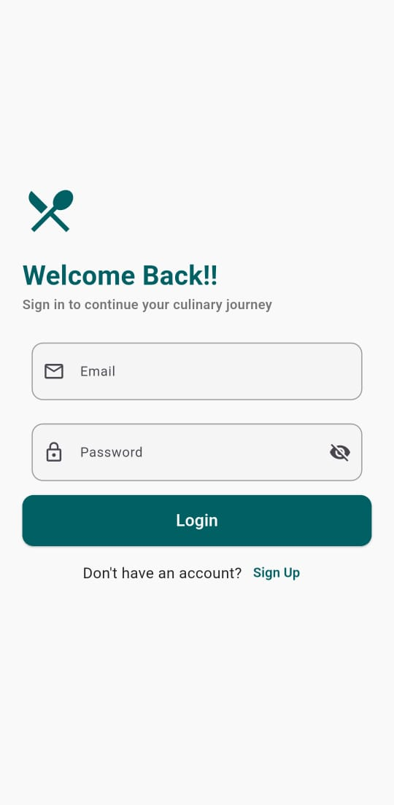
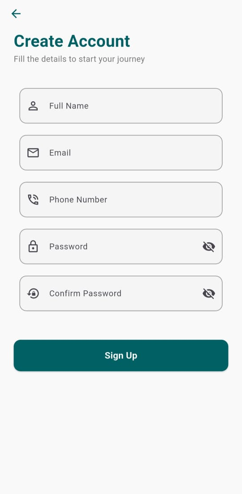
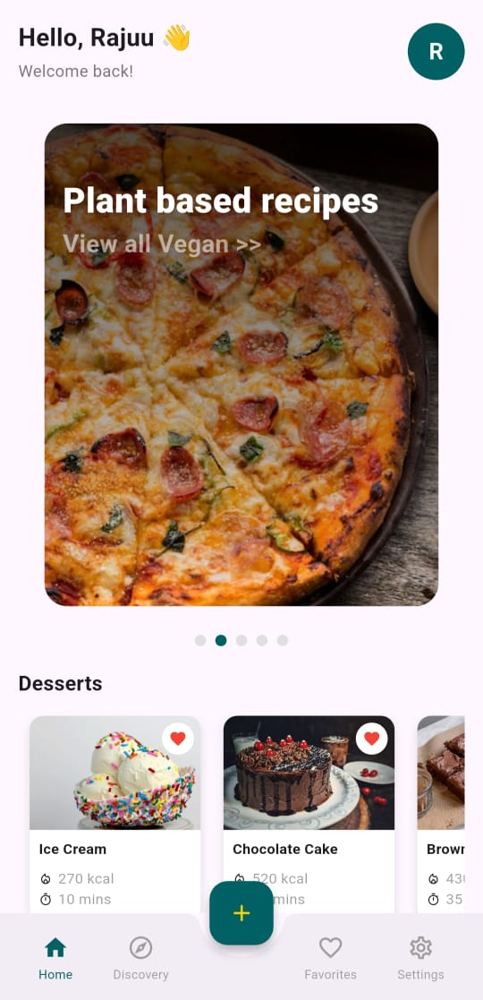
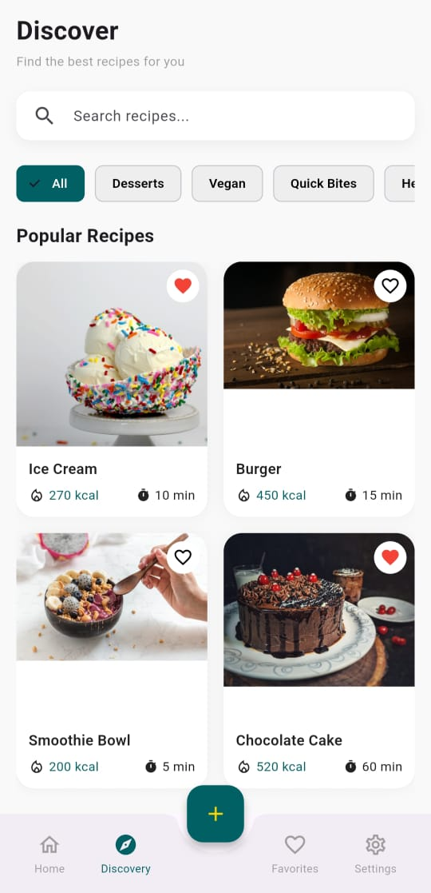
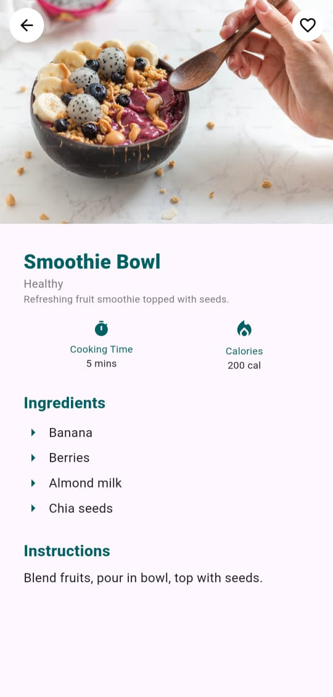
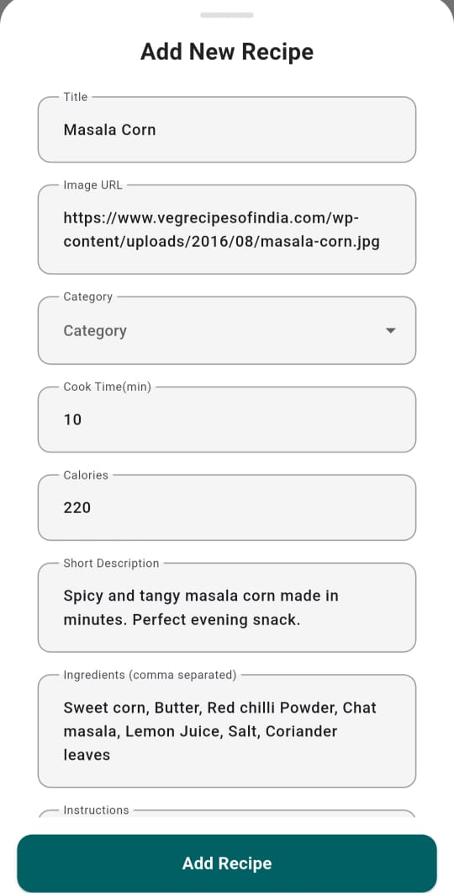
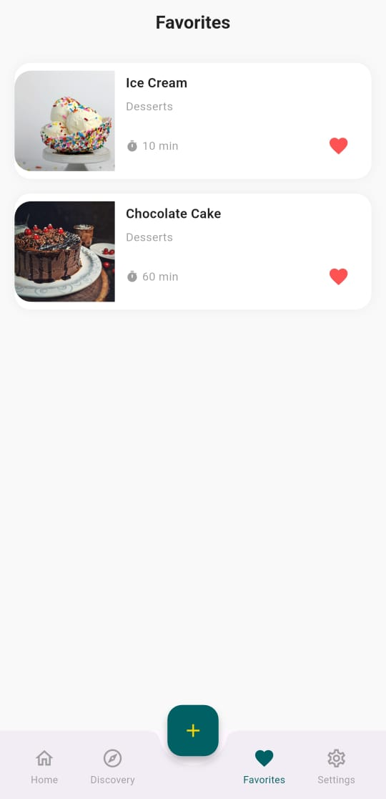

# 🍽️ Recipe App

A modern **Flutter Recipe App** that allows users to discover, add, and save their favorite recipes. The app uses **Firebase** for authentication, data storage, and user-specific features like favorites.

---

## 🛠️ Tech Stack

- **Flutter** – Frontend UI  
- **Dart** – Programming language  
- **Firebase** – Authentication & Firestore backend  
- **Riverpod** – State management  

---

## 🚀 Features

- **Authentication**
  - Firebase Email/Password login and registration
  - Persistent user sessions
- **Discover Recipes**
  - Browse recipes by category
  - Search recipes in real-time
- **Recipe Details**
  - View recipe details: ingredients, instructions, cook time, calories
- **Add Recipes**
  - Users can add new recipes with image, title, category, ingredients, and instructions
- **Favorites**
  - Mark/unmark recipes as favorite
  - Favorites are user-specific and persistent
- **Settings**
  - Edit user profile
  - Logout functionality

---

## 📸 Screenshots

### Splash Screen || Login Screen || Register Screen

  &nbsp;&nbsp;&nbsp;&nbsp;&nbsp;&nbsp;&nbsp;&nbsp;  &nbsp;&nbsp;&nbsp;&nbsp;&nbsp;&nbsp;&nbsp;&nbsp;  

### Home Screen || Discovery Screen || Recipe Details Screen

  &nbsp;&nbsp;&nbsp;&nbsp;&nbsp;&nbsp;&nbsp;&nbsp;  &nbsp;&nbsp;&nbsp;&nbsp;&nbsp;&nbsp;&nbsp;&nbsp;  

### Add Recipe || Favorites || Settings

  &nbsp;&nbsp;&nbsp;&nbsp;&nbsp;&nbsp;&nbsp;&nbsp;  &nbsp;&nbsp;&nbsp;&nbsp;&nbsp;&nbsp;&nbsp;&nbsp;  

---

## 🎯 Project Highlights

- Fully functional recipe app with **user-based favorite recipes**
- Firebase integration for data persistence
- Clean UI using Flutter widgets and custom cards
